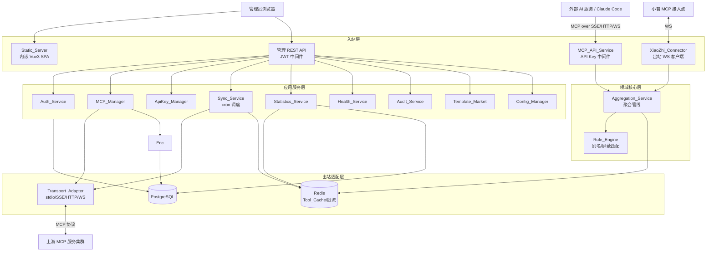
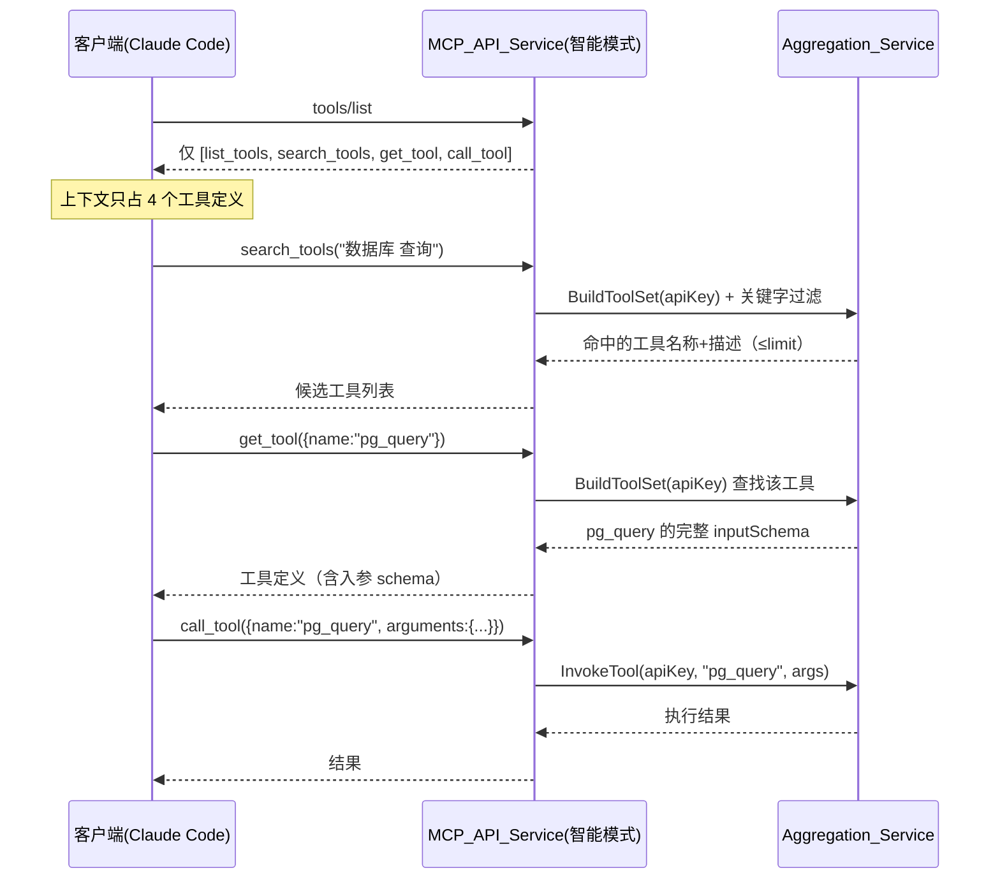
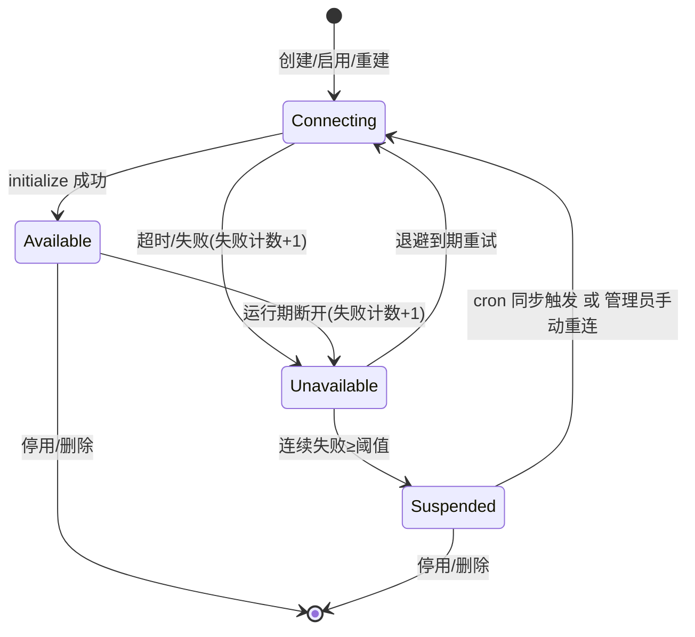

# 设计文档：MCP Proxy Gateway

## Overview

MCP Proxy Gateway 是一个单进程的 MCP 聚合与代理网关：对内通过 REST 管理 API + 内嵌的 Vue3 静态界面（基于开源模板 TailAdmin Vue 构建）供管理员配置，对外以多种 MCP 传输形式（SSE / Streamable-HTTP / WebSocket）暴露聚合后的工具能力供外部 AI 服务与小智 AI 调用。

本设计文档聚焦于**返工成本极高的架构决策**：分层边界、核心抽象接口契约、数据模型、聚合管线执行顺序、智能模式的按需工具发现机制、连接生命周期状态机、同步调度与限流策略。文档**不逐条复述验收标准**，而是在关键决策处标注其覆盖的需求编号，确保设计与需求的 Glossary 组件命名一致。

### 设计原则

- **单进程内嵌**：Go 二进制通过 `embed` 内嵌前端构建产物，由 `Static_Server` 直接提供静态资源访问，无需 Nginx（Req 17、24）。
- **两个 API 面分离**：对内管理面（管理员 JWT 鉴权）与对外 MCP 面（API Key 鉴权）路由与中间件完全分离，互不污染。
- **缓存优先聚合**：聚合服务永远从 `Tool_Cache` 读取工具列表，绝不在聚合请求路径上向上游 MCP 发起实时 `tools/list`（Req 6.2）。
- **规则与工具解耦**：别名/屏蔽规则绑定在上游 MCP 或 API Key 上，基于名称或正则匹配，工具列表变化时规则保持稳定（Req 8、9、13）。
- **管线确定性**：聚合工具集合的构建是一个固定顺序的纯函数管线，便于属性测试验证不变量（名称唯一、屏蔽幂等、别名可逆）。

### 关键术语映射

设计中的组件名严格对应需求 Glossary：`Transport_Adapter`（传输适配层）、`MCP_Manager`（连接管理器）、`Sync_Service`（同步服务）、`Tool_Cache`（工具缓存）、`Rule_Engine`（规则引擎）、`Aggregation_Service`（聚合服务）、`MCP_API_Service`（对外 MCP API 服务）、`ApiKey_Manager`、`Statistics_Service`、`XiaoZhi_Connector`、`Auth_Service`、`Config_Manager`、`Static_Server`、`Health_Service`、`Audit_Service`、`Template_Market`。

## Architecture

### 分层架构

系统采用清晰的分层：入站适配层（HTTP/WS 路由 + 中间件）→ 应用服务层（业务编排）→ 领域核心层（规则引擎、聚合管线）→ 出站适配层（传输适配、存储、缓存）。出站方向通过接口抽象，便于 mock 与属性测试。



### 进程内数据流（两条主路径）

1. **管理面（写配置）**：浏览器 → 管理 REST API（JWT 校验）→ 应用服务 → PostgreSQL/YAML，并触发连接重建或缓存失效。
2. **服务面（调工具）**：外部 AI → MCP_API_Service（API Key 校验 + 限流 + 来源白名单）→ 聚合服务（读缓存 + 规则）→ 传输适配层 → 上游 MCP，结果原样返回并异步记录统计。

## 技术选型与理由

### 后端（Go）

| 关注点 | 选型 | 理由 |
|--------|------|------|
| 语言/运行时 | Go 1.22+ | 单二进制部署、并发模型契合大量长连接代理；`embed` 内嵌前端 |
| MCP 协议 | 官方 `github.com/modelcontextprotocol/go-sdk`（mark3labs/mcp-go 作为备选） | 复用标准 MCP 类型与 JSON-RPC 处理，**不自研协议栈**；同时作为上游客户端与对外服务端 |
| HTTP 框架 | `gin` | 中间件生态成熟，便于实现 JWT / API Key 两套中间件链与 SPA fallback 路由 |
| WebSocket | `nhooyr.io/websocket`（或 `gorilla/websocket`） | 对外 WS 传输与小智出站客户端共用 |
| 定时调度 | `github.com/robfig/cron/v3` | 标准 cron 表达式校验与秒级调度，满足 Req 7 |
| PG 驱动 | `pgx/v5` + `sqlc` 生成类型安全查询（ORM 备选 `gorm`） | 避免运行时反射开销，统计写入与查询性能可控 |
| 数据库迁移 | `golang-migrate/migrate` | 版本化 schema 迁移，启动时自动执行，保证升级平滑 |
| Redis 客户端 | `github.com/redis/go-redis/v9` | 工具缓存、限流计数窗口、统计异步缓冲 |
| JWT | `github.com/golang-jwt/jwt/v5` | 管理员会话令牌签发与校验（Req 1） |
| 凭证存储 | PostgreSQL 明文列 | 自部署场景下上游凭证明文存储，便于编辑回显与复制（Req 19） |
| 配置 | `gopkg.in/yaml.v3` + `caarlos0/env` | YAML 常规配置 + 环境变量读取（Req 18） |
| 密码哈希 | `golang.org/x/crypto/bcrypt` | 管理员密码加盐哈希（Req 1） |
| 日志 | 标准库 `log/slog` | 结构化启动连通性日志与审计（Req 20） |

**关键理由说明**：MCP 协议层选择官方/成熟 SDK 是返工成本最高的决策点——既要作为**客户端**连接异构上游（stdio/SSE/HTTP/WS），又要作为**服务端**对外暴露（SSE/HTTP/WS）。统一 SDK 可避免协议版本漂移与重复实现。

### 前端（Vue3）

| 关注点 | 选型 | 理由 |
|--------|------|------|
| 框架/构建 | Vue 3 + Vite + TypeScript（随 TailAdmin 模板提供） | 现代化、构建产物易内嵌；基于开源模板 TailAdmin Vue（vue-tailwind-admin-dashboard）克隆改造，复用其已内置的 Vite + TypeScript 工程结构（Req 25.1、17.8） |
| 样式与 UI | Tailwind CSS + TailAdmin 模板 | 需求明确指定（Req 17.8、25.7）；全部界面以 Tailwind CSS 工具类构建并遵循 TailAdmin 的组件与视觉风格，**不依赖任何组件式 UI 库**（移除 Ant Design Vue）；下拉/组合框/日期选择/弹窗/表格等复杂控件采用 TailAdmin 自带组件或 headless 工具结合 Tailwind 实现 |
| 图表 | ApexCharts（TailAdmin 内置，按需） | 统计页若需图表，复用模板已集成的 ApexCharts，避免额外引入图表库 |
| 状态管理 | Pinia | Vue3 官方推荐，管理会话与全局配置 |
| 路由 | Vue Router（history 模式） | 配合后端 SPA fallback（Req 17.2） |
| 请求层 | Axios + 统一拦截器 | 注入 JWT、统一处理 401/令牌失效重定向（Req 17.6） |
| 响应式 | Tailwind 响应式工具类 + TailAdmin 布局组件 | 借助 Tailwind 的响应式断点工具类与模板自带的响应式布局，覆盖手机/平板/PC/宽屏/4K 五档视口（Req 17.3） |
| 代码质量 | ESLint + Prettier（含 prettier-plugin-tailwindcss） | 统一代码风格、减少风格争议；Prettier 通过 `prettier-plugin-tailwindcss` 对 Tailwind 工具类一致排序，ESLint 与 Prettier 规则互不冲突（Req 25.3-25.5、25.4） |

#### 工程初始化与代码质量工具链（Req 25）

为避免手工拼凑目录与配置，前后端均基于成熟基础初始化：

- **前端**：**基于开源模板 TailAdmin Vue（vue-tailwind-admin-dashboard）初始化**，而非 `npm create vue@latest` 从零创建。具体做法：将当前已脚手架的 `web/` 目录改名留存（备份）→ 克隆 TailAdmin 模板作为新的 `web/` → **在重新实现业务/页面代码之前，先升级核心依赖**（详见下文「依赖升级前置步骤」）→ 在模板之上**重新实现已构建的功能**（登录页、路由守卫、401 拦截器、响应式断点组合式函数、会话 store、Axios 请求层），并按需补充管理界面页面。复用模板已内置的 Vite + TypeScript + Tailwind CSS 与基础布局（Req 25.1、25.7）。样式统一以 Tailwind CSS 工具类编写并遵循 TailAdmin 视觉风格，**不引入 Ant Design Vue 等组件式 UI 库**（Req 17.8）。代码质量工具链：ESLint 负责静态检查、Prettier 负责格式化，并启用 `prettier-plugin-tailwindcss` 对 Tailwind 工具类做一致排序；ESLint 与 Prettier 通过官方推荐的集成方式协同（避免规则冲突，Req 25.4）。`package.json` 提供 `lint`（校验，发现问题以非零退出码报告）与 `format`（格式化）脚本。
- **后端**：用 `go mod init` 初始化模块，再按设计的分层在该模块下补充包目录；Go 代码统一以 `gofmt`/`goimports` 格式化。CI 中可加入 `go vet` 作为基础静态检查。

**依赖升级前置步骤（克隆模板后、编写业务/页面代码前）**：TailAdmin 模板 `package.json` 中固定（pin）的依赖版本往往滞后，若等到大量业务代码落地后再升级，迁移成本将显著放大。因此在克隆模板、清理示例页面之后、**重新实现任何功能/页面之前**，先将核心依赖升级到**最新的兼容稳定版本**：

- **核心运行时与构建**：Vue 3.x、Vite、TypeScript。
- **核心工具链**：vue-router、pinia、`@vitejs/plugin-vue`、vue-tsc、ESLint、Prettier（含 `prettier-plugin-tailwindcss`）、Tailwind CSS，以及其它核心工程工具（类型声明、构建/校验相关插件等）。
- **升级原则**：升级到**最新兼容**的稳定版本（注意各依赖间的主版本兼容矩阵，如 Vite 与 `@vitejs/plugin-vue`、Tailwind 与 `prettier-plugin-tailwindcss` 的配套关系），避免引入不兼容的破坏性组合。
- **升级验证**：升级后执行一次**干净安装 + 类型检查 + Lint + 生产构建**（如 `npm install` / `npm run build`，并运行 `vue-tsc` 类型检查与 `lint` 脚本），确保在业务代码体量尚小时尽早暴露并修复任何破坏性变更（breaking change）。
- **版本固定**：将升级后的版本在 `package.json` 中固定（pin），并在说明中标注「此升级有意安排在页面实现之前进行，以避免在大量业务代码落地后再做代价高昂的滞后升级」。

**前端迁移落地路径（指导任务拆分）**：① 将现有脚手架 `web/` 改名为备份目录；② 克隆 TailAdmin Vue 模板作为新的 `web/`，清理模板示例页面；③ **升级核心依赖到最新兼容稳定版本**（Vue 3.x、Vite、TypeScript、vue-router、pinia、`@vitejs/plugin-vue`、vue-tsc、ESLint、Prettier + `prettier-plugin-tailwindcss`、Tailwind CSS 等），并通过干净安装、类型检查、Lint 与生产构建（`npm install` / `npm run build`）验证、在 `package.json` 中固定版本——此步骤须在编写业务代码前完成；④ 将已实现的能力（登录页、路由守卫、401 拦截器、响应式断点 composable、会话 store、Axios 请求层）移植/重写到模板结构上；⑤ 按 Tailwind + TailAdmin 风格实现各管理页面。


为兼顾手机到 4K 超大屏的体验，采用五档断点而非简单的内容横向拉满。核心原则：**小屏保证可用与可触达，大屏提升信息密度并避免视线过长**。

| 档位 | 视口宽度 | 布局策略 |
|------|----------|----------|
| 手机 | < 768px | 侧边栏抽屉化（汉堡菜单，复用 TailAdmin 抽屉式侧边栏）；表格转为卡片式或仅保留关键列 + 横向滚动；表单单列；操作收进「更多」菜单 |
| 平板 | 768–1023px | 侧边栏可折叠为图标栏；表格保留常用列；表单单列或双列 |
| 笔记本/PC | 1024–1439px | 侧边栏常驻展开；表格完整列；表单双列；主内容铺满 |
| 宽屏 | 1440–2559px | 主内容区设最大宽度并居中（如 1440–1600px 容器，使用 Tailwind `max-w-*` + `mx-auto`），两侧留白；列表+详情可启用双栏（左列表右详情）；表格提升可见列数与每页条数 |
| 4K 超大屏 | ≥ 2560px | 主内容区维持最大宽度居中，**不无限拉伸**；进一步启用双栏/三栏看板（如规则管理左中右）；统计页多卡片网格并排；字号与间距适度放大，避免视线跨度过大 |

实现要点：
- 全局定义统一的断点常量（与上表一致），与 Tailwind 配置中的响应式断点（`sm`/`md`/`lg`/`xl`/`2xl` 及自定义超大屏断点）对齐，避免各页面各自硬编码。
- 布局以 Tailwind 响应式工具类（如 `md:`、`lg:`、`2xl:` 前缀）配合 TailAdmin 自带的响应式布局组件实现，替代组件式 UI 库的栅格系统。
- 主内容容器统一用 Tailwind `max-w-*` + `mx-auto` 设最大宽度并居中，是大屏体验的关键——防止表单字段被拉到极宽、表格列间距过稀。
- 表格在大屏自动提高默认分页条数（如 PC 20、宽屏 50），减少翻页；窄屏降低条数。
- 侧边栏、表格列可见性、表单列数随断点切换，组件层用统一的「当前断点」组合式函数（composable）获取，集中管理。


### 部署

单一 Docker 镜像，多阶段构建：阶段一 `node` 构建前端 → 阶段二 `golang` 将 `dist/` 通过 `//go:embed` 嵌入二进制 → 最终 `distroless`/`alpine` 运行镜像。GitHub Action 在推送触发时构建并发布镜像（Req 24）。

## Components and Interfaces

各组件职责严格对应需求 Glossary。下面描述每个组件的边界与协作关系，关键抽象的接口契约见后续「关键接口契约」小节。

### 出站适配组件

- **Transport_Adapter（传输适配层）**：屏蔽 stdio/SSE/Streamable-HTTP/WebSocket 差异，向上提供统一的 MCP 客户端会话（初始化、`tools/list`、`tools/call`、关闭）。负责按传输类型校验必填连接参数、携带鉴权凭证、连接建立超时控制（Req 4）。**边界**：只负责单条连接的协议收发，不负责重试与生命周期（由 MCP_Manager 编排）。**stdio 约束**：stdio 传输以子进程方式启动上游 MCP，要求网关运行环境（含容器镜像）中存在对应可执行文件与运行时；若部署在 distroless/alpine 镜像中需自备依赖，否则 stdio 类型上游不可用——此约束在部署章节再次提示。

### 连接与同步组件

- **MCP_Manager（连接管理器）**：上游 MCP 的 CRUD、启停、排序、连接生命周期与重试退避状态机（Req 2、3、5）。**边界**：拥有连接池与连接状态，是唯一可发起连接重建的组件；删除时级联清理工具缓存与规则。

- **Sync_Service（同步服务）**：基于 cron 调度从上游拉取工具列表写入缓存，含并发去重、超时、失败降级（Req 6、7）。**边界**：只写 Tool_Cache，不直接对外提供工具；调用 Transport_Adapter 拉取。

- **Tool_Cache（工具缓存）**：Redis（热路径）+ PostgreSQL（持久化）双层，存储每个上游 MCP 的完整工具列表与更新时间戳（Req 6）。**边界**：以「整列表替换」为唯一写语义，避免增量合并的一致性问题。

### 领域核心组件

- **Rule_Engine（规则引擎）**：别名重命名、描述重写、屏蔽过滤的匹配与应用；支持精确匹配与正则完整匹配（full match）、多规则排序、单条启停（Req 8、9、13）。**边界**：纯函数式——输入工具列表 + 规则集合，输出变换后的工具列表，无副作用，便于属性测试。

- **Aggregation_Service（聚合服务）**：编排聚合管线（读缓存 → 排序合并 → 屏蔽 → 别名/描述重写 → 去重 → API Key 级过滤），并负责工具调用的路由与别名反向映射（Req 3、10）。**边界**：聚合结果是可见工具集合的唯一来源，对外服务面与小智接入面共用。

### 入站/对外组件

- **MCP_API_Service（对外 MCP API 服务）**：以 MCP 协议多传输（SSE/HTTP/WS）对外暴露聚合能力；实现智能模式（网关工具 + 按需发现）与全量模式（Req 11）。**边界**：调用前先经 API Key 校验、限流、来源白名单中间件。

- **XiaoZhi_Connector（小智接入服务）**：出站 WebSocket 客户端，连接小智 MCP 接入点，将聚合能力提供给小智，含指数退避重连（Req 15）。**边界**：复用 Aggregation_Service，是「反向」的服务面（网关作为客户端连出）。

- **Static_Server（静态资源服务）**：提供内嵌 Vue3 SPA，SPA fallback 路由（Req 17）。

### 管理与横切组件

- **Auth_Service（认证服务）**：管理员单用户注册/登录/会话/改密，凭证写入 YAML（Req 1）。
- **ApiKey_Manager（API Key 管理器）**：API Key 生命周期、绑定屏蔽规则与访问控制（IP/CIDR、有效期、速率上限）（Req 12、13、21）。完整明文密钥仅在创建响应中返回一次，之后只暴露前缀与元数据（Req 12.3）。
- **Statistics_Service（统计服务）**：异步采集调用记录，多维度统计与排行，保留期清理（Req 16）。
- **Template_Market（模板市场）**：内置分类化快捷模板的检索与详情，驱动表单预填充（Req 14）。
- **Config_Manager（配置管理器）**：YAML + 环境变量读写、默认值生成、导入导出备份（Req 18、23）。
- **Health_Service（健康检查服务）**：启动连通性日志、公开存活探针、鉴权详细健康端点（Req 20）。
- **Audit_Service（审计日志服务）**：记录登录、配置变更、被拒访问，分页查询与保留期清理（Req 22）。

## 关键接口契约

以下 Go interface 伪代码定义返工成本最高的核心抽象。具体实现细节留待编码阶段，但**接口边界一旦确定不应轻易变动**。

### 传输适配层

统一不同传输类型，向上仅暴露 MCP 会话语义。新增传输类型只需实现该接口，不影响上层。

```go
// TransportType: stdio | sse | streamable-http | websocket
type TransportType string

// 单条上游 MCP 会话的统一抽象（Req 4）
type UpstreamSession interface {
    // 建立连接并完成 MCP initialize 握手，受 connectTimeout 约束
    Connect(ctx context.Context) error
    // 拉取工具列表（Sync_Service 使用，Req 6）
    ListTools(ctx context.Context) ([]ToolDef, error)
    // 转发工具调用，原始参数透传（Req 10.3）
    CallTool(ctx context.Context, name string, args json.RawMessage) (ToolResult, error)
    Close() error
}

// 工厂：按传输类型 + 连接参数构造会话，并校验必填参数（Req 4.5/4.6/4.8）
type TransportFactory interface {
    // 参数校验失败返回字段级校验错误，不建立连接
    NewSession(cfg UpstreamConfig) (UpstreamSession, error)
    Supports(t TransportType) bool
}
```

### 规则引擎

纯函数式接口，无副作用，是属性测试的主要目标。

```go
// 工具定义（聚合管线中流动的核心数据）
type ToolDef struct {
    OriginalName string          // 上游原始名称（路由依据）
    Name         string          // 对外暴露名称（可被别名/去重改写）
    Description  string
    InputSchema  json.RawMessage
    UpstreamID   string          // 所属上游 MCP
    Order        int             // 继承所属上游的排序
}

type Rule_Engine interface {
    // 应用屏蔽规则：返回未被任一启用规则匹配的工具（Req 9）
    ApplyFilters(tools []ToolDef, filters []FilterRule) []ToolDef
    // 应用别名/描述重写：每个工具仅命中第一条匹配规则（Req 8.5）
    ApplyAliases(tools []ToolDef, aliases []AliasRule) []ToolDef
    // 名称匹配：正则 full match 或区分大小写精确相等（Req 8.7/8.8、9.5/9.6）
    Match(pattern string, isRegex bool, originalName string) (bool, error)
    // 规则保存前校验（正则合法性、模式长度、目标字段非空等）
    ValidateAlias(r AliasRule) error
    ValidateFilter(r FilterRule) error
}
```

### 聚合管线

```go
type Aggregation_Service interface {
    // 构建某 API Key 视角的可见聚合工具集合（执行完整管线，Req 10、13）
    BuildToolSet(ctx context.Context, apiKeyID string) ([]ToolDef, error)
    // 调用聚合工具：别名反向映射 → 路由到上游 → 原样返回结果（Req 10.3/10.6）
    InvokeTool(ctx context.Context, apiKeyID, exposedName string, args json.RawMessage) (ToolResult, error)
}

// 缓存读取抽象（Req 6.2，聚合永不实时拉取上游）
type Tool_Cache interface {
    Get(ctx context.Context, upstreamID string) ([]ToolDef, time.Time, bool)
    Replace(ctx context.Context, upstreamID string, tools []ToolDef) error // 整列表替换
    Delete(ctx context.Context, upstreamID string) error
}
```

### 连接生命周期

```go
type ConnState string // connecting | available | unavailable | suspended

type MCP_Manager interface {
    Create(ctx context.Context, cfg UpstreamConfig) (Upstream, error)
    Update(ctx context.Context, id string, cfg UpstreamConfig) (Upstream, error) // 重建连接
    Delete(ctx context.Context, id string) error // 级联清缓存与规则
    Reorder(ctx context.Context, orderedIDs []string) error // 校验完整性（Req 3.5）
    SetEnabled(ctx context.Context, id string, enabled bool) error
    GetState(id string) (ConnState, string) // 状态 + 最近失败原因（Req 5.4）
    Reconnect(ctx context.Context, id string) error // 管理员手动重连（Req 5.6）
}
```

## Data Models

### PostgreSQL 表结构

业务数据持久化到 PostgreSQL（Req 23.3）。下面是核心表的概念结构（省略索引细节，关键索引在备注中标注）。

```sql
-- 上游 MCP 服务（Req 2、3、4）
CREATE TABLE upstream_mcp (
    id            UUID PRIMARY KEY,
    name          VARCHAR(100) NOT NULL UNIQUE,          -- 名称唯一（Req 2.7）
    transport     VARCHAR(32)  NOT NULL,                 -- stdio|sse|streamable-http|websocket
    conn_params   JSONB        NOT NULL,                 -- 传输相关连接参数
    credential_enc BYTEA,                                -- 加密后的鉴权凭证（Req 19）
    enabled       BOOLEAN      NOT NULL DEFAULT true,
    sort_order    INTEGER      NOT NULL,                 -- 排序（Req 3.4）
    auto_sync     BOOLEAN      NOT NULL DEFAULT false,   -- 自动同步开关（Req 7）
    created_at    TIMESTAMPTZ  NOT NULL DEFAULT now(),
    updated_at    TIMESTAMPTZ  NOT NULL DEFAULT now()
);

-- 别名规则（独立规则，支持全部上游或多上游作用范围，Req 8）
CREATE TABLE alias_rule (
    id           UUID PRIMARY KEY,
  scope_type   VARCHAR(16) NOT NULL DEFAULT 'all',       -- all|upstreams
    pattern      VARCHAR(200) NOT NULL,
    is_regex     BOOLEAN NOT NULL DEFAULT false,
    target_name  VARCHAR(100),                            -- 目标名称（与描述至少一项）
    target_desc  VARCHAR(1024),
    sort_order   INTEGER NOT NULL,                        -- 多规则按序仅应用首条（Req 8.5）
    created_at   TIMESTAMPTZ NOT NULL DEFAULT now()
);

  CREATE TABLE alias_rule_upstream (
    rule_id     UUID NOT NULL REFERENCES alias_rule(id) ON DELETE CASCADE,
    upstream_id UUID NOT NULL REFERENCES upstream_mcp(id) ON DELETE CASCADE,
    PRIMARY KEY (rule_id, upstream_id)
  );

  -- 屏蔽规则（独立规则，支持全部上游或多上游作用范围，Req 9）
CREATE TABLE filter_rule_mcp (
    id           UUID PRIMARY KEY,
    scope_type   VARCHAR(16) NOT NULL DEFAULT 'all',       -- all|upstreams
    pattern      VARCHAR(200) NOT NULL,
    is_regex     BOOLEAN NOT NULL DEFAULT false,
    enabled      BOOLEAN NOT NULL DEFAULT true,           -- 单条启停（Req 9.11）
    sort_order   INTEGER NOT NULL,
    created_at   TIMESTAMPTZ NOT NULL DEFAULT now()
);

  CREATE TABLE filter_rule_mcp_upstream (
    rule_id     UUID NOT NULL REFERENCES filter_rule_mcp(id) ON DELETE CASCADE,
    upstream_id UUID NOT NULL REFERENCES upstream_mcp(id) ON DELETE CASCADE,
    PRIMARY KEY (rule_id, upstream_id)
  );

-- API Key 元数据（Req 12）
CREATE TABLE api_key (
    id            UUID PRIMARY KEY,
    name          VARCHAR(100) NOT NULL,
    key_hash      BYTEA NOT NULL,                          -- 仅存哈希，不存明文（Req 12.3）
    key_prefix    VARCHAR(12) NOT NULL,                    -- 展示用前缀
    enabled       BOOLEAN NOT NULL DEFAULT true,
    expires_at    TIMESTAMPTZ,                             -- 可选有效期（Req 12.6）
    rate_limit    INTEGER,                                 -- 可选速率上限（Req 21）
    rate_window_s INTEGER,                                 -- 计数窗口秒数
    created_at    TIMESTAMPTZ NOT NULL DEFAULT now()
);

-- API Key 屏蔽规则（绑定 API Key，Req 13）
CREATE TABLE filter_rule_apikey (
    id          UUID PRIMARY KEY,
    api_key_id  UUID NOT NULL REFERENCES api_key(id) ON DELETE CASCADE,
    pattern     VARCHAR(200) NOT NULL,
    is_regex    BOOLEAN NOT NULL DEFAULT false,
    enabled     BOOLEAN NOT NULL DEFAULT true,
    sort_order  INTEGER NOT NULL
    -- 约束：同一 api_key_id 下最多 100 条（Req 13.2，应用层强制）
);

-- API Key 访问控制白名单（IP/CIDR，Req 13.9）
CREATE TABLE api_key_acl (
    id          UUID PRIMARY KEY,
    api_key_id  UUID NOT NULL REFERENCES api_key(id) ON DELETE CASCADE,
    cidr        CIDR NOT NULL
);

-- 工具缓存持久化副本（Redis 为热路径，PG 为持久层，Req 6.1）
CREATE TABLE tool_cache (
    upstream_id  UUID PRIMARY KEY REFERENCES upstream_mcp(id) ON DELETE CASCADE,
    tools        JSONB NOT NULL,
    updated_at   TIMESTAMPTZ NOT NULL
);

-- 调用统计记录（Req 16）
CREATE TABLE call_stat (
    id            BIGSERIAL PRIMARY KEY,
    upstream_id   UUID,                                    -- 稳定统计维度（不随别名/排序改名而断裂）
    original_name VARCHAR(100) NOT NULL,                    -- 上游原始工具名（稳定标识）
    exposed_name  VARCHAR(100),                             -- 调用时的对外名，仅作展示
    api_key_id    UUID,
    called_at     TIMESTAMPTZ NOT NULL,                     -- 毫秒精度
    latency_ms    INTEGER NOT NULL,
    success       BOOLEAN NOT NULL
    -- 索引：(called_at)、(upstream_id, called_at)、(api_key_id, called_at)、(upstream_id, original_name)
    -- 按 called_at 分区，便于保留期清理（Req 16.10）
);

-- 审计日志（Req 22）
CREATE TABLE audit_log (
    id          BIGSERIAL PRIMARY KEY,
    event_type  VARCHAR(64) NOT NULL,                      -- login|create|update|delete|access_denied
    target      VARCHAR(255),
    detail      JSONB,
    occurred_at TIMESTAMPTZ NOT NULL DEFAULT now()         -- 倒序分页查询（Req 22.4）
);
```

**设计要点**：
- 删除上游 MCP 时通过 `ON DELETE CASCADE` 级联清理别名/屏蔽规则与缓存副本（Req 2.5、6.6）。
- 规则数量上限（100 条）在应用层强制，避免依赖数据库触发器（Req 9.2/9.9、13.2/13.3）。
- `call_stat` 按时间分区，保留期清理通过 `DROP PARTITION` 高效完成（Req 16.10）。
- **统计维度用稳定标识**：`call_stat` 以 `(upstream_id, original_name)` 作为工具的稳定统计维度，避免别名重命名或上游重排序导致改名后历史统计断裂；`exposed_name` 仅用于展示层回显。按工具维度的统计/排行基于稳定标识聚合，展示时再映射到当前对外名。
- **API Key 明文仅创建时返回一次**：API Key 仅存哈希 + 前缀。完整明文密钥**只在创建那一刻的响应中完整返回一次**，此后任何列表/详情查询都只返回前缀与元数据、永不再返回完整明文（Req 12.3）。前端须提示用户立即妥善保存。

### 数据库迁移（Schema 版本管理）

为保证升级时表结构平滑演进，引入 `golang-migrate`（或等价的版本化迁移方案）管理 schema：

- 迁移脚本以版本号有序存放，随二进制一同发布（可用 `embed` 内嵌）。
- 系统启动时自动检测当前 schema 版本并执行待应用的向上迁移，迁移失败则记录错误并终止启动（与配置加载失败一致的失败语义，Req 18.3）。
- 迁移在连接 PostgreSQL 成功之后、对外提供服务之前执行，确保运行期表结构始终与代码匹配。

### Redis 缓存键设计与 TTL

Redis 承载热路径数据。键命名采用 `mpg:` 前缀分域。

| 用途 | 键模式 | 值 | TTL | 说明 |
|------|--------|-----|-----|------|
| 工具缓存 | `mpg:tools:{upstreamID}` | JSON(ToolDef 数组) + updatedAt | 无（同步覆盖） | 整列表替换；PG 为持久兜底（Req 6） |
| 限流计数 | `mpg:rl:{apiKeyID}:{windowStart}` | 计数器 INT | = 窗口长度 | 固定窗口计数（Req 21）；`INCR` + `EXPIRE` |
| 统计异步缓冲 | `mpg:stats:buffer`（List/Stream） | 调用记录 | 无 | 主流程 `LPUSH`，后台 worker 批量落 PG（Req 16.8） |
| 连接状态快照 | `mpg:connstate:{upstreamID}` | 状态 + 失败原因 | 无 | 供健康端点查询（Req 5.4、20.7） |

**为何不缓存聚合结果**：聚合管线是内存纯函数，输入已是从 Redis 读到的各上游工具列表（热路径），再叠加规则匹配的开销很小。若额外缓存 `aggset`，会引入「规则启停/排序/缓存刷新后必须主动失效」的一致性负担，收益有限却增加复杂度。因此**默认每次实时构建聚合工具集合**：既天然满足规则启停在「该次更新之后接收的请求」即时生效（Req 9.11、13.8），又避免过度设计。若未来在超大规模上游下出现性能瓶颈，可再以「带版本号失效」的方式引入聚合缓存作为优化，但不作为初始设计。

### YAML 配置结构

YAML 文件存于挂载的 `data/` 目录，保存常规配置与管理员凭证（Req 18、23）。数据库与 Redis 连接来自环境变量，不入 YAML。

```yaml
admin:                          # 管理员凭证（Req 1）
  username: "admin"
  password_hash: "$2a$..."      # bcrypt 加盐哈希
  initialized: true             # 首次初始化标志（Req 1.1）

auth:
  session_timeout_s: 3600       # 会话超时，范围 300-86400（Req 1.4/1.7）

sync:
  cron: "0 */30 * * * *"        # 标准 cron，校验后持久化（Req 7.3）
  timeout_s: 30                 # 同步超时，范围 5-300（Req 7.5）

connection:                     # 连接与重试（Req 4、5）
  connect_timeout_s: 30         # 连接建立超时（Req 4.9）
  retry_initial_backoff_s: 1    # 初始退避，范围 1-60（Req 5.1）
  retry_multiplier: 2
  retry_max_backoff_s: 60       # 退避上限，范围 1-3600（Req 5.3）
  failure_threshold: 5          # 连续失败阈值，范围 1-100（Req 5.6）

aggregation:
  upstream_call_timeout_s: 30   # 上游调用超时，范围 1-600（Req 10.8）

mcp_api:
  mode: "smart"                 # smart | full（Req 11）
  smart_discovery_limit: 50     # 工具发现返回数，范围 1-200（Req 11.4）

statistics:
  top_limit_default: 10         # 排行默认条数，范围 1-100（Req 16.3）
  retention_days: 90            # 统计保留期，范围 1-3650（Req 16.10）

audit:
  page_size_default: 20         # 范围 1-200（Req 22.4）
  retention_days: 180           # 审计保留期，范围 1-3650（Req 22.5）

xiaozhi:
  enabled: false
  endpoint: ""                  # ws:// 或 wss://（Req 15.6）
```

**JWT 密钥来源**：管理员登录 JWT 签名密钥在首次启动时随机生成并写入 `config.yaml` 的 `jwt_secret`；上游 MCP 凭证按自部署场景明文存储并在编辑时回显。

## 关键管线与算法

本节是设计的核心，明确这些机制可避免实现跑偏导致的高成本返工。

### 工具聚合管线（执行顺序固定）

聚合管线是一个确定性的纯函数流水线。**执行顺序不可调换**，否则会破坏名称唯一性与过滤语义（Req 3、10、13）。


各阶段说明：

1. **缓存读取**：从 Tool_Cache 读取所有 `enabled=true` 上游的工具列表，停用上游完全不参与（Req 3.3、6.2、10.1）。
2. **排序合并**：按 `upstream.sort_order` 由前到后拼接（Req 3.4、10.1）。
3. **MCP 级屏蔽**：对每个工具的 `OriginalName` 应用其所属上游的启用屏蔽规则；命中即排除。先屏蔽再重写（Req 10.2）。
4. **别名/描述重写**：对每个保留工具，按规则 `sort_order` 找**第一条**匹配的别名规则应用目标名称/描述，其余忽略（Req 8.2/8.3/8.5）。
5. **同名去重**：若多个上游暴露相同对外名称，排序在前者保留原名，排序在后者追加可区分后缀（如 `__{upstreamShortId}`），保证集合内名称全局唯一（Req 3.6、8.6）。
6. **API Key 级过滤**：在统一聚合结果之上，再应用该 API Key 的启用屏蔽规则。与 MCP 级屏蔽一致，匹配对象是工具的 `OriginalName`（上游原始名称），而非别名重写后的对外名（Req 13.5/13.6/13.7）。

**关键不变量**：管线输出的工具集合中，对外 `Name` 全局唯一；同时维护 `Name → (UpstreamID, OriginalName)` 的反向映射用于调用路由（见下）。

### 工具调用与别名反向映射

调用聚合工具时，需将对外名称映射回上游原始名称再转发（Req 10.3/10.6）：

```
InvokeTool(apiKeyID, exposedName, args):
  toolset = BuildToolSet(apiKeyID)          # 含反向映射
  if exposedName not in toolset:            # 不在可见集合
      return ToolNotFoundError              # Req 10.4 / 11.7 / 13(过滤后不可见)
  (upstreamID, originalName) = reverseMap[exposedName]
  if connState(upstreamID) != available:
      return UpstreamUnavailableError       # Req 10.5
  result = withTimeout(upstream_call_timeout_s):  # Req 10.8
      session(upstreamID).CallTool(originalName, args)  # 原始参数透传
  recordStatAsync(...)                       # Req 16，异步
  return result                              # 成功或上游错误原样返回（Req 10.3）
```

### 智能模式：网关工具与按需工具发现

**这是解决 Claude Code 等客户端上下文窗口浪费的核心机制（Req 11.3-11.7）**。全量模式会一次性把数百个工具定义塞进上下文；智能模式只暴露少量「网关工具」，让客户端按需检索、获取入参结构与调用，工具定义不再占满上下文。

**网关工具集合（智能模式下对外仅暴露这些）**：

| 网关工具 | 输入 | 输出 | 说明 |
|----------|------|------|------|
| `list_tools` | `{ cursor?, limit? }` | 工具名称+简述的分页列表 | 概览可见工具，不返回完整 schema |
| `search_tools` | `{ query: string, limit?=50 }` | 名称或描述包含关键字的工具列表（默认 50，范围 1-200） | 关键字检索（Req 11.4）；无匹配返回空列表（Req 11.5） |
| `get_tool` | `{ name: string }` | 单个工具的完整定义（名称、描述、`inputSchema`） | 调用前获取入参结构，闭环 `call_tool` 的参数构造；工具不可见时返回工具不存在错误 |
| `call_tool` | `{ name: string, arguments: object }` | 目标工具执行结果 | 路由到具体聚合工具（Req 11.6）；不存在则报错（Req 11.7） |

**为什么需要 `get_tool`**：`list_tools` 与 `search_tools` 只返回名称+简述以节省上下文，客户端据此选定目标工具后，需先用 `get_tool` 取回该工具的完整 `inputSchema`，才能正确构造 `call_tool` 的 `arguments`。这样既保持检索结果轻量（不把所有 schema 塞进上下文），又让单个工具的调用参数闭环可用——这是智能模式真正能跑通的关键。

**交互流程**：



`search_tools`、`get_tool` 与 `call_tool` 都基于**当前可见聚合工具集合**（已过完整管线，含 API Key 级过滤），保证智能模式与全量模式的可见性一致，差异仅在「暴露方式」（Req 11）。`get_tool` 与 `call_tool` 请求的工具若不在可见集合中，返回工具不存在错误（Req 11.7）。

### 连接生命周期与重试退避状态机

MCP_Manager 为每条上游连接维护状态机（Req 5）。退避为指数式：`backoff = min(initial * multiplier^n, maxBackoff)`。



- **Available → 重置**：重连成功后，连续失败计数归零并恢复供给工具（Req 5.5）。
- **Unavailable**：状态标记为不可用并记录最近失败原因，供状态查询与健康端点返回（Req 5.4、20.7）。
- **Suspended**：连续失败达到阈值后记录告警并暂停自动重试，仅由 cron 同步周期或管理员手动重连唤醒（Req 5.6）。
- 退避间隔任何单次都不超过 `retry_max_backoff_s` 上限，状态查询体现当前生效上限（Req 5.3）。

### 同步调度（cron / 并发去重 / 超时 / 失败降级）

Sync_Service 用 `robfig/cron` 调度（Req 7）。

```
on cron tick (per enabled & auto_sync upstream):
  if syncInProgress[upstreamID]:           # 上次未完成
      skip this trigger                    # Req 7.8 并发去重
  syncInProgress[upstreamID] = true
  try:
      tools = withTimeout(sync_timeout_s):  # Req 7.5
          session(upstreamID).ListTools()
      Tool_Cache.Replace(upstreamID, tools) # 整列表替换（Req 6.1）
  catch (timeout | error):
      keep last successful cache            # 失败降级，保留旧缓存（Req 7.5）
      record sync_failure_event(reason)
  finally:
      syncInProgress[upstreamID] = false
```

- cron 表达式更新通过校验后：取消旧调度未触发任务、不重启即按新周期生效（Req 7.6/7.7）。
- 手动刷新走相同拉取逻辑：成功则立即替换缓存（Req 6.4），失败则保留旧缓存并返回刷新失败错误（Req 6.5）。
- 缓存缺失时（已启用上游无缓存）触发一次拉取（Req 6.3）。

### 限流（按 API Key 固定计数窗口）

基于 Redis 固定窗口计数（Req 21）。窗口键含窗口起点，自然滚动。

```
rateLimit(apiKeyID):
  if apiKey.rate_limit == nil: return allow   # 未配置不限流（Req 21.4）
  windowStart = floor(now / rate_window_s) * rate_window_s
  key = "mpg:rl:{apiKeyID}:{windowStart}"
  n = INCR(key)
  if n == 1: EXPIRE(key, rate_window_s)
  if n > rate_limit: return RateLimitError    # 超额拒绝（Req 21.2）
  return allow                                 # 下一窗口自动恢复（Req 21.3）
```

### 统计异步写入与降级

统计写入绝不阻塞工具调用主流程（Req 16.8/16.9）。

```
工具调用完成 → LPUSH mpg:stats:buffer {record}  (非阻塞, <50ms)
后台 worker → 批量 BRPOP/读取 → 批量 INSERT call_stat
  写入失败 → 丢弃该批记录, 不影响主流程, 不向调用方报错（Req 16.9）
保留期清理 → 定时 DROP 超过 retention_days 的时间分区（Req 16.10）
```

## 多传输对外暴露与路由划分

### 路由分面

两个 API 面在路由前缀与中间件链上完全分离，避免管理面与服务面互相污染。

| 面 | 前缀 | 鉴权中间件 | 说明 |
|----|------|-----------|------|
| 静态资源 | `/`、`/assets/*` | 无 | 内嵌 Vue3 SPA；非 API/非文件路径 fallback 到 `index.html`（Req 17.2） |
| 管理 REST API | `/api/admin/*` | 管理员 JWT | 上游/规则/API Key/设置/统计/审计/模板（Req 17.5） |
| 对外 MCP API | `/mcp/sse`、`/mcp/http`、`/mcp/ws` | API Key + 限流 + 来源白名单 | 多传输暴露聚合能力（Req 11.8） |
| 公开存活探针 | `/healthz` | 无 | 仅返回自身存活（Req 20.6） |
| 详细健康 | `/api/admin/health` | 管理员 JWT | 各依赖与上游连接明细（Req 20.7/20.8） |

### 对外多传输

`MCP_API_Service` 在 `/mcp/sse`（Server-Sent Events）、`/mcp/http`（Streamable-HTTP）、`/mcp/ws`（WebSocket）三个端点暴露同一聚合能力，传输实现复用 MCP SDK 的 server transport（Req 11.8）。小智接入是第四种「反向」暴露——网关作为 WS 客户端连出到小智接入点（Req 15）。

### 鉴权中间件

- **管理员 JWT**：校验 `Authorization: Bearer <token>`，验证签名与过期（会话超时），失败返回 401（Req 1.6/1.7）。
- **对外 API Key**：从请求头/查询参数提取 API Key → 校验存在/启用/未过期（Req 11.9、12.5）→ 来源 IP 命中 ACL 白名单（Req 13.9/13.10）→ 限流（Req 21）。任一不通过即拒绝且不路由到任何聚合能力。

## 跨切面设计

### 凭证存储

上游鉴权凭证按自部署场景明文存储，管理界面编辑时直接回显并随配置整体覆盖保存（Req 19）。管理员 JWT 签名密钥在首次启动时随机生成并写入 `config.yaml`，避免所有部署共享固定密钥。

### 健康检查

- 公开 `/healthz`：仅返回 `{status: "ok"}`，不泄露依赖明细（Req 20.6）。
- 鉴权 `/api/admin/health`：返回 PG/Redis/各上游/小智的当前连通性（Req 20.7），未鉴权返回 401（Req 20.8）。

### 启动连通性日志

启动时按序探测并用 `slog` 结构化记录：PostgreSQL、Redis、各启用上游 MCP、（若启用）小智接入点；任一失败记录失败原因（Req 20.1-20.5）。必需环境变量缺失/无效或 YAML 非法时记录错误并终止启动（Req 18.3/18.6、19.4）。

### 错误模型

统一错误响应结构，区分类别便于前端与调用方处理：

```go
type APIError struct {
    Code    string `json:"code"`    // VALIDATION | NOT_FOUND | CONFLICT | UNAUTHORIZED
                                     // | FORBIDDEN | RATE_LIMITED | UPSTREAM_UNAVAILABLE
                                     // | UPSTREAM_TIMEOUT | TOOL_NOT_FOUND
    Message string `json:"message"`
    Fields  map[string]string `json:"fields,omitempty"` // 字段级校验错误
}
```

校验错误须标识每个无效字段（Req 2.2、4.8、14.10）；上游错误结果原样透传而非包装（Req 10.3）。

### 并发与连接池

- 每条上游 MCP 连接由 MCP_Manager 持有，长连接复用；并发调用通过会话内的请求-响应关联（JSON-RPC id）支持。
- PostgreSQL 使用 `pgxpool` 连接池；Redis 使用 go-redis 内置连接池。
- 同步并发去重用进程内 `sync.Map[upstreamID]bool` 标志（Req 7.8）。

### 性能要点

- 聚合管线为内存纯函数，热路径只读 Redis 缓存，不触上游（Req 6.2）。
- 统计写入异步缓冲，主流程附加耗时 < 50ms（Req 16.8）。
- 限流用 Redis 原子 `INCR`，避免锁竞争。

## 部署

### 单镜像构建

多阶段 Docker 构建，前端产物嵌入 Go 二进制（Req 24.1）：

```dockerfile
# 阶段一：构建前端
FROM node:20 AS web
WORKDIR /web
COPY web/ .
RUN npm ci && npm run build       # 产出 dist/

# 阶段二：编译 Go（embed 前端 dist）
FROM golang:1.22 AS build
WORKDIR /src
COPY . .
COPY --from=web /web/dist ./internal/static/dist   # 供 //go:embed 嵌入
RUN CGO_ENABLED=0 go build -o /out/mpg ./cmd/gateway

# 阶段三：运行镜像
FROM gcr.io/distroless/static
COPY --from=build /out/mpg /mpg
VOLUME ["/data"]                  # 挂载 data 卷（Req 23.1）
ENTRYPOINT ["/mpg"]
```

Go 侧通过 `//go:embed dist/*` 将前端产物编译进二进制，`Static_Server` 从 `embed.FS` 提供（Req 17.1）。

### 环境变量与 data 卷

| 环境变量 | 说明 |
|----------|------|
| `MPG_PG_DSN` | PostgreSQL 连接串（Req 18.1） |
| `MPG_REDIS_ADDR` / `MPG_REDIS_PASSWORD` | Redis 连接（Req 18.1） |
| `MPG_DATA_DIR` | data 目录路径，默认 `/data`（Req 23.1） |

YAML 配置与本地持久化数据存于 `/data`；容器重建重新挂载同卷即可恢复（Req 23.2）。YAML 不存在时以默认配置创建（Req 18.5）。

**stdio 上游的容器化约束**：默认运行镜像（distroless/alpine）只含网关二进制，不包含第三方 MCP 的可执行文件与运行时（如 node、python、uvx 等）。若需接入 stdio 类型上游，部署方须使用自带相应运行时的镜像或在镜像中预装对应依赖，否则该 stdio 上游连接会建立失败。SSE/Streamable-HTTP/WebSocket 类型为远程连接，无此约束。

### GitHub Action 流水线概要

```yaml
on:
  push:
    tags: ["v*"]                  # 发布触发条件（Req 24.3）
jobs:
  build-and-push:
    steps:
      - checkout
      - docker/build-push-action  # 构建单一镜像（Req 24.1/24.3）
      - 登录并推送到远程镜像仓库     # 发布（Req 24.4）
      # 任一步骤失败 → 工作流标记失败并记录原因（Req 24.5）
```

## 配置导入导出与备份

`Config_Manager` 支持导出当前配置为可导入备份文件（Req 23.4），导入时校验格式与内容后应用（Req 23.5），格式无效或校验失败则拒绝并返回错误（Req 23.6）。备份覆盖 YAML 常规配置与 PG 中的业务配置（上游/规则/API Key 元数据）。

## Correctness Properties

*属性（property）是系统在所有合法执行中都应保持成立的特征或行为——一个关于"系统应当做什么"的形式化陈述。属性是人类可读规格与机器可验证正确性保证之间的桥梁。*

下列属性聚焦于核心领域逻辑（规则引擎、聚合管线、退避、限流、往返与校验），均为纯函数或可建模的确定性逻辑，适合属性测试（PBT）。基础设施、UI、外部连通性等不适合 PBT 的条目已在「Testing Strategy」中以集成/冒烟/示例测试覆盖。

### Property 1: 聚合工具名称全局唯一

*For any* 启用上游集合及其工具列表（含跨上游同名工具与会造成冲突的别名规则），聚合管线输出的可见工具集合中所有对外名称互不相同，且排序在前的上游保留其原始名称、排序在后的同名工具被赋予可区分标记。

**Validates: Requirements 3.6, 8.6**

### Property 2: 上游排序在聚合中保持

*For any* 上游集合与一个合法排序，聚合输出中各上游的工具均按该排序由前到后出现。

**Validates: Requirements 3.4, 10.1**

### Property 3: 排序请求完整性校验

*For any* 已注册上游集合，若提交的排序不是其标识的恰好一次排列（包含未注册、缺失或重复标识），则该排序请求被拒绝且已持久化排序保持不变；当且仅当为合法排列时被接受。

**Validates: Requirements 3.5**

### Property 4: 名称匹配语义一致

*For any* 匹配模式与工具原始名称，当开启正则时匹配结果等价于该模式对名称的正则完整匹配（full match），当关闭正则时等价于区分大小写的精确相等比较；该语义在别名、MCP 级屏蔽、API Key 级屏蔽三处一致。

**Validates: Requirements 8.7, 8.8, 9.5, 9.6, 13.5, 13.6**

### Property 5: 屏蔽规则匹配与启停即时性

*For any* 工具集合与屏蔽规则集合，可见集合不包含任何被启用规则匹配的工具，且停用的规则在匹配中被忽略；翻转某规则的启用状态后重新构建的集合按更新后的状态反映其影响。

**Validates: Requirements 9.3, 9.4, 9.11, 13.8**

### Property 6: 多别名规则仅应用首条

*For any* 同时匹配多条别名规则的工具，输出仅采用按 sort_order 排列的第一条匹配规则的目标名称/描述，其余匹配规则不生效。

**Validates: Requirements 8.2, 8.3, 8.5**

### Property 7: 管线顺序——屏蔽先于重写

*For any* 同时匹配某条启用屏蔽规则与某条别名规则的工具，最终可见集合中该工具被排除（不会因别名重写而重新出现）。

**Validates: Requirements 10.2**

### Property 8: API Key 级可见集合为全局集合子集

*For any* API Key 与其启用屏蔽规则集合，该 API Key 的可见工具集合是全局聚合集合的子集，且不包含任何被该 Key 启用规则匹配的工具。

**Validates: Requirements 13.7**

### Property 9: 别名反向映射可逆

*For any* 经别名重写后的可见工具，按其对外名称发起调用时，反向映射能唯一还原出 (上游标识, 原始工具名称) 并以原始参数转发。

**Validates: Requirements 10.6**

### Property 10: 不可见工具调用必被拒

*For any* 不属于当前可见聚合工具集合的工具名称，调用请求返回工具不存在错误且不向任何上游 MCP 转发该调用。

**Validates: Requirements 10.4, 11.7**

### Property 11: 智能模式工具发现与获取结果正确

*For any* 可见工具集合与查询关键字，search_tools 返回的每个工具其名称或描述都包含该关键字、返回数量不超过配置上限（默认 50，范围 1-200），且当无任何工具命中时返回空列表而非错误；*for any* 可见工具，get_tool 按其对外名称返回该工具的完整定义（含 inputSchema），对不可见工具名称返回工具不存在错误。

**Validates: Requirements 11.4, 11.5, 11.7**

### Property 12: 规则校验拒绝非法规则

*For any* 别名或屏蔽规则，若其开启正则但模式非合法正则、或模式为空、或模式长度超过 200、或（别名）目标名称与目标描述均缺失，则保存被拒绝且不持久化任何数据。

**Validates: Requirements 8.9, 9.7, 9.8, 13.4**

### Property 13: 规则数量上限

*For any* 上游 MCP 或 API Key 的屏蔽规则集合，当已有规则达到 100 条时新增规则被拒绝且不持久化；不超过上限时被接受。

**Validates: Requirements 9.2, 9.9, 13.2, 13.3**

### Property 14: 指数退避不超过上限且非递减

*For any* 初始退避间隔、倍数 2 与最大退避上限，第 n 次重试的退避间隔等于 min(initial × 2^n, max)，因而任何单次退避均不超过配置上限，且序列在封顶前单调不减。

**Validates: Requirements 5.1, 5.2, 5.3**

### Property 15: 重连成功重置失败计数

*For any* 处于不可用/失败状态且具有任意连续失败计数的上游连接，应用"重连成功"状态转移后，其连续失败计数归零且状态变为可用。

**Validates: Requirements 5.5**

### Property 16: 工具缓存整列表替换往返

*For any* 工具列表，对某上游执行缓存整列表替换后再读取，得到的列表与写入列表等价。

**Validates: Requirements 6.1, 6.2**

### Property 17: JWT 签名密钥首次生成

*For any* 初始配置，当 `jwt_secret` 为空时启动期生成非空随机密钥并写回；当已有密钥时保持不变。

**Validates: Requirements 19.1, 19.2**

### Property 18: cron 表达式校验

*For any* 字符串，当且仅当其为标准 cron 格式且每个字段取值落在合法范围内时校验通过并可持久化，否则被拒绝并返回格式错误。

**Validates: Requirements 7.3, 7.4**

### Property 19: 同步并发去重

*For any* 上游 MCP，当其上一次同步尚未完成时到达的新同步触发被跳过，且同步完成后其进行中标志被释放以允许后续触发。

**Validates: Requirements 7.8**

### Property 20: 限流不超额且窗口恢复

*For any* 配置了速率上限与计数窗口的 API Key 及一段请求序列，单个计数窗口内被受理的请求数不超过该上限、超额请求被拒，进入下一窗口后配额恢复；未配置上限的 API Key 所有请求均被放行。

**Validates: Requirements 21.1, 21.2, 21.3, 21.4**

### Property 21: 来源白名单匹配

*For any* API Key 的 IP/CIDR 白名单与请求来源地址，当且仅当来源地址落在白名单内任一 CIDR 中时请求被允许，否则被拒绝并返回访问被拒错误。

**Validates: Requirements 13.9, 13.10**

### Property 22: 统计时间范围闭区间过滤

*For any* 调用记录集合与由开始/结束时间构成的范围，统计仅计入闭区间（含端点）内的记录；若开始时间晚于结束时间则查询被拒绝并返回范围无效错误。

**Validates: Requirements 16.5, 16.7**

### Property 23: 工具排行降序且条数受限

*For any* 调用计数数据与配置的返回条数（默认 10，范围 1-100），工具排行按调用次数降序排列且返回条数不超过该配置。

**Validates: Requirements 16.3**

### Property 24: 审计日志倒序分页

*For any* 审计记录集合与页大小（默认 20，范围 1-200），分页查询结果按发生时间倒序排列，且各页之间不重叠、不遗漏。

**Validates: Requirements 22.4**

### Property 25: 模板关键字检索命中

*For any* 模板集合与关键字，检索返回的每个模板其名称或简介都包含该关键字，且无匹配时返回空列表。

**Validates: Requirements 14.4, 14.5**

### Property 26: 模板必填占位参数校验

*For any* 基于快捷模板的创建请求，若缺失任一必填占位参数则创建被拒绝、不持久化任何配置并返回指明缺失参数名称的错误。

**Validates: Requirements 14.10**

### Property 27: 配置导入导出往返

*For any* 系统配置，导出为备份文件后再导入得到等价配置；对格式非法或校验失败的备份文件，导入被拒绝并返回备份无效错误。

**Validates: Requirements 23.4, 23.5, 23.6**

### Property 28: 管理员凭证哈希往返校验

*For any* 合法的用户名（3-32 字符）与密码（6-128 字符），以加盐哈希注册后，使用相同凭证校验成功、使用不匹配凭证校验失败；长度越界的注册输入被拒绝且不写入任何账号。

**Validates: Requirements 1.2, 1.5, 1.9**

### Property 29: 小智接入点地址协议校验

*For any* 字符串地址，当且仅当其为以 ws:// 或 wss:// 为前缀的合法 WebSocket URL 时保存被接受，否则被拒绝且保持现有配置不变。

**Validates: Requirements 15.6**

### Property 30: 传输连接参数校验

*For any* 传输类型与连接参数，当且仅当该类型受支持（stdio/SSE/Streamable-HTTP/WebSocket）且其全部必填参数齐备且格式合法时校验通过，否则拒绝建立连接并返回标识缺失/非法参数的校验错误。

**Validates: Requirements 4.5, 4.6, 4.8**

## Error Handling

错误分类与处理策略，统一通过前述 `APIError` 模型对外返回。

| 场景 | 错误类别 | 处理 |
|------|---------|------|
| 字段校验失败（上游配置、规则、API Key 名称、模板参数） | `VALIDATION` | 不持久化，返回字段级错误（Req 2.2、4.8、8.9、12.8、14.10） |
| 资源不存在（上游/API Key） | `NOT_FOUND` | 不变更，返回资源不存在（Req 2.6、12.7） |
| 名称冲突 | `CONFLICT` | 不持久化，返回冲突（Req 2.7） |
| 令牌缺失/无效/过期 | `UNAUTHORIZED` | 拒绝，前端清会话并重定向登录（Req 1.6、17.6、20.8） |
| 来源地址不在白名单 | `FORBIDDEN` | 拒绝（Req 13.10） |
| 超过速率上限 | `RATE_LIMITED` | 拒绝超额请求（Req 21.2） |
| 上游连接不可用 | `UPSTREAM_UNAVAILABLE` | 不转发，返回上游不可用（Req 10.5） |
| 上游调用超时 | `UPSTREAM_TIMEOUT` | 中止，不返回部分结果（Req 10.8） |
| 调用不存在/不可见工具 | `TOOL_NOT_FOUND` | 不转发（Req 10.4、11.7） |

**降级原则**：
- 同步/刷新失败保留旧缓存，不破坏可用工具集合（Req 6.5、7.5）。
- 统计写入失败静默丢弃，绝不影响工具调用主流程与返回（Req 16.9）。
- 上游返回的错误结果原样透传给调用方，不二次包装（Req 10.3）。
- 启动期致命错误（环境变量缺失、YAML 非法、加密密钥无效）记录日志并终止启动（Req 18.3/18.6、19.4）。

## Testing Strategy

采用**双轨测试**：属性测试验证通用不变量，单元/集成/冒烟测试覆盖具体场景、外部依赖与一次性配置。

### 属性测试（Property-Based Testing）

- **库选型**：Go 使用 `pgregory.net/rapid`（或 `leanovate/gopter`），**不从零实现 PBT 框架**。
- **配置**：每个属性测试最少运行 100 次迭代。
- **标注**：每个属性测试以注释标注其对应设计属性，格式：
  `// Feature: mcp-proxy-gateway, Property {编号}: {属性文本}`
- **覆盖**：本设计「Correctness Properties」中的每条属性以**单个**属性测试实现。
- **生成器重点**：
  - 工具集合生成器需覆盖跨上游同名、含/不含别名冲突、空集合等边界（Property 1/5/6）。
  - 名称/模式生成器覆盖正则与精确、大小写差异、空与超长（Property 4/12）。
  - 退避/限流生成器覆盖封顶、窗口边界、零配置（Property 14/20）。
  - 字符编码/特殊字符在凭证、工具名、模式生成器中覆盖（Property 16/17）。

### 单元测试

聚焦具体示例、边界与错误条件：唯一性冲突的具体后缀格式、特定校验错误消息、状态机各转移的具体触发。避免与属性测试重复覆盖输入空间。

### 集成测试（不适合 PBT 的外部行为）

- 四种上游传输类型各 1-3 个 mock/真实上游连接与协议初始化（Req 4.1-4.4）。
- 对外三种传输端点（SSE/HTTP/WS）端到端各 1-2 例（Req 11.8）。
- 小智 WS 接入连接与重连（Req 15）。
- 健康端点鉴权与公开探针、SPA fallback 路由（Req 17.2、20.6-20.8）。

### 冒烟测试（一次性配置/启动）

- 环境变量与 YAML 加载、缺失/非法时启动终止（Req 18.3/18.6、19.4）。
- 容器以挂载 data 卷启动后管理界面与 MCP API 可用（Req 24.2）。
- GitHub Action 构建与发布流水线（Req 24.3-24.5）。

## 安全考量小结

- **凭证存储**：自部署场景下上游凭证明文存储并在管理界面编辑时回显，降低用户维护成本；API Key 保留哈希 + 前缀 + 明文备份列的既有策略；管理员密码 bcrypt 加盐哈希（Req 1）。
- **两面鉴权隔离**：管理面 JWT 与对外面 API Key 中间件链分离，对外面附加来源白名单与限流，纵深防御（Req 11.9、13.9、21）。
- **密钥来源**：JWT 签名密钥首次启动自动生成并写入 `config.yaml`，避免开源二进制内置固定密钥导致跨部署伪造风险。
- **审计可追溯**：登录、配置变更、被拒访问均记审计（Req 22），便于安全事件溯源。
- **输入校验前置**：所有外部输入（配置、规则、模板参数、cron、URL）在持久化/生效前校验，正则编译错误受控捕获，避免 ReDoS 需对正则复杂度设上限（模式长度 ≤ 200 已部分约束）。
- **健康端点最小暴露**：公开探针不泄露依赖拓扑（Req 20.6）。

## 可测试性策略

- **纯函数核心**：规则引擎与聚合管线无副作用，输入工具列表 + 规则 → 输出工具列表，是属性测试的理想目标。
- **接口隔离外部依赖**：Transport_Adapter、Tool_Cache、仓储等以接口抽象，测试时注入 mock，使聚合/路由逻辑可脱离真实上游与 Redis/PG 验证。
- **确定性管线**：聚合管线顺序固定、去重后缀规则确定，便于断言不变量与回归。
- **时间与随机可注入**：退避、限流窗口、统计时间戳通过可注入的时钟与 ID 生成器，消除测试不确定性。

---

本设计文档已覆盖需求文档中的全部 24 个需求，并在关键决策处标注对应需求编号。如需在进入任务拆分前调整任一架构决策、接口契约或属性定义，可返回本设计阶段迭代；若发现需求层面的缺口，也可返回需求澄清阶段补充。
